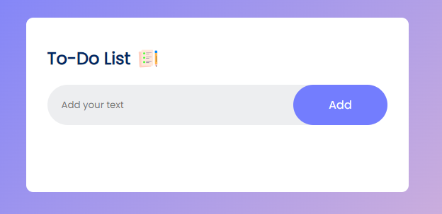
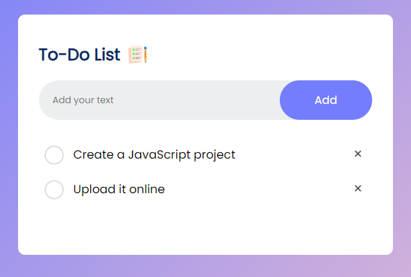

# ToDo List README

Welcome to the ToDo List application repository! This is a simple yet effective web application that helps you manage your tasks. It's built using HTML, CSS, and JavaScript to provide a user-friendly and interactive task management experience.

## Table of Contents
- [Introduction](#introduction)
- [Features](#features)
- [Installation](#installation)
- [Usage](#usage)
- [Technologies Used](#technologies-used)
- [Screenshots](#screenshots)
- [Contributing](#contributing)
- [License](#license)

## Introduction
The ToDo List app is a project created by Thembi as part of your journey in upskilling in web development. It allows users to add, edit, and mark tasks as completed, helping them stay organized and productive.

## Features
- **Task Management:** Add, edit, and delete tasks.
- **Mark Completed:** Easily mark tasks as completed.
- **Data Persistence:** Tasks are saved locally, so they persist across sessions.
- **Responsive Design:** Enjoy a seamless experience on both desktop and mobile devices.

## Installation
To run the ToDo List app locally, follow these steps:

1. Clone this repository:
   ```
   git clone https://github.com/ngww/todo-list.git
   ```

2. Navigate to the project directory:
   ```
   cd todo-list
   ```

3. Open the `index.html` file in your preferred web browser.

## Usage
1. Open the app in your browser.
2. Add tasks by entering a task description and selecting a priority.
3. Click the "Add Task" button to add the task to your list.
4. To edit a task, click the "Edit" button next to it.
5. To mark a task as completed, click the checkbox next to it.
6. To delete a task, click the "Delete" button next to it.

## Technologies Used
- HTML5
- CSS3
- JavaScript
- Local Storage (for data persistence)

## Screenshots
[Live Demo](https://todo-list-ngww.vercel.app)




## Contributing
Contributions to the ToDo List app are welcome! If you have ideas for improvements or find any issues, please feel free to create a pull request. Please ensure that your contributions align with the project's goals.

## License
This project is licensed under the [MIT License](LICENSE).

---

Thank you for checking out the ToDo List app! It's a handy tool to help you stay organized and manage your tasks effectively. If you have any questions or suggestions, feel free to contact me via twitter at @ngwcodes. Happy task management!